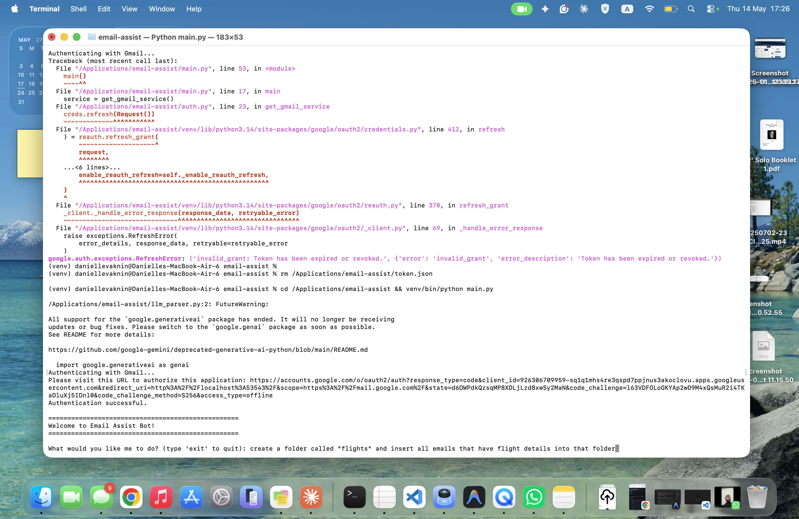
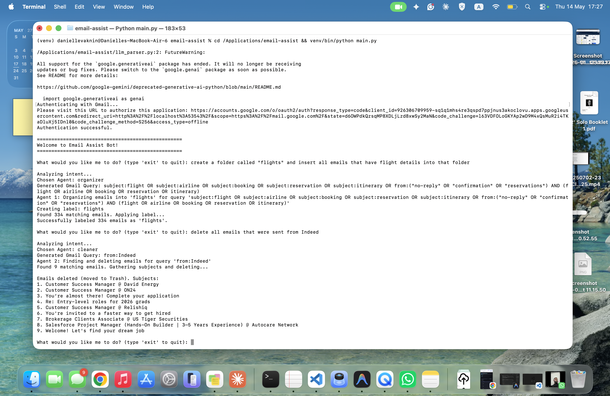
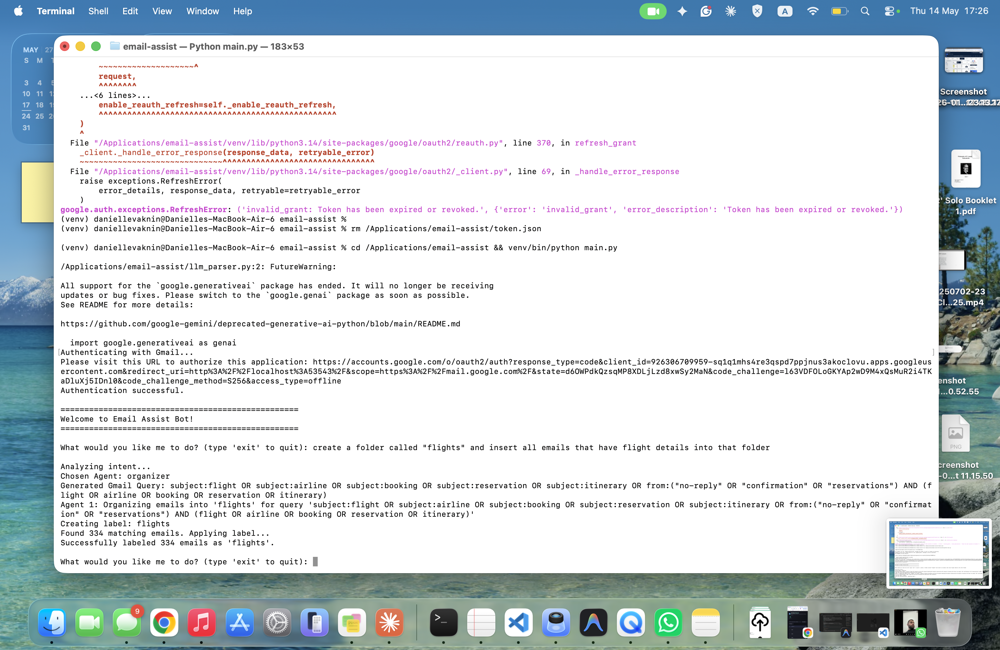
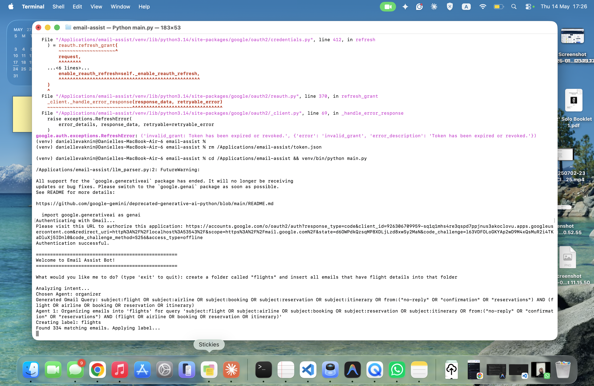

# Email Inbox Manager — Dual Agent System

A personal AI-powered command-line tool that manages my Gmail inbox 
through two specialized agents. I describe what I want in plain English 
and the system figures out what to do.

## What It Does

**Agent 1 — Organizer**
Moves emails into labeled folders based on natural language instructions.
"Put all my flight confirmations in a Travel folder" → finds them, 
creates the label if it doesn't exist, applies it.

**Agent 2 — Cleaner**
Deletes emails matching a natural language description.
"Delete all promotional emails from last year" → finds them, 
moves them to trash in bulk.

## How It Works
Your instruction (plain English)
↓
Gemini Flash parses intent → identifies agent + Gmail search query
↓
Gmail API executes the action at scale (handles pagination,
batches up to 1000 emails per API call)

## Stack
- Python
- Google Gemini 2.5 Flash — intent parsing and Gmail query generation
- Gmail API — email search, labeling, and deletion
- Pydantic — structured output validation from LLM response
- google-auth — OAuth2 authentication with token refresh

## Usage Examples
What would you like me to do?

Move all LinkedIn emails to a LinkedIn folder

Chosen Agent: organizer
Generated Gmail Query: from:linkedin.com
Creating label: LinkedIn
Found 847 matching emails. Applying label...
Successfully labeled 847 emails as 'LinkedIn'.

What would you like me to do?

Delete all emails from Groupon

Chosen Agent: cleaner
Generated Gmail Query: from:groupon.com
Found 1,203 matching emails. Gathering subjects and deleting...
Emails deleted (moved to Trash).

## Design Decisions

**Why Gemini Flash for parsing?**
It's fast, free, and supports structured JSON output natively — 
perfect for a lightweight intent parser that doesn't need 
reasoning depth, just reliable classification and query generation.

**Why two separate agents?**
Delete and organize are fundamentally different risk levels. 
Keeping them separate makes the logic clear and makes it easy 
to add a confirmation step to the cleaner agent without 
touching the organizer.

**Why batchModify in chunks of 1000?**
Gmail API enforces a 1000 message limit per batch request. 
The chunking handles inboxes of any size without hitting API limits.

## Roadmap & Future Enhancements
- Confirmation prompt before bulk deletion showing affected count 
  and sample subjects
- Dry run mode — preview what would be affected without executing
- Undo support — restore trashed emails within a session
- Streamlit UI for non-terminal use
- Support for archiving as an action alongside organize and delete
