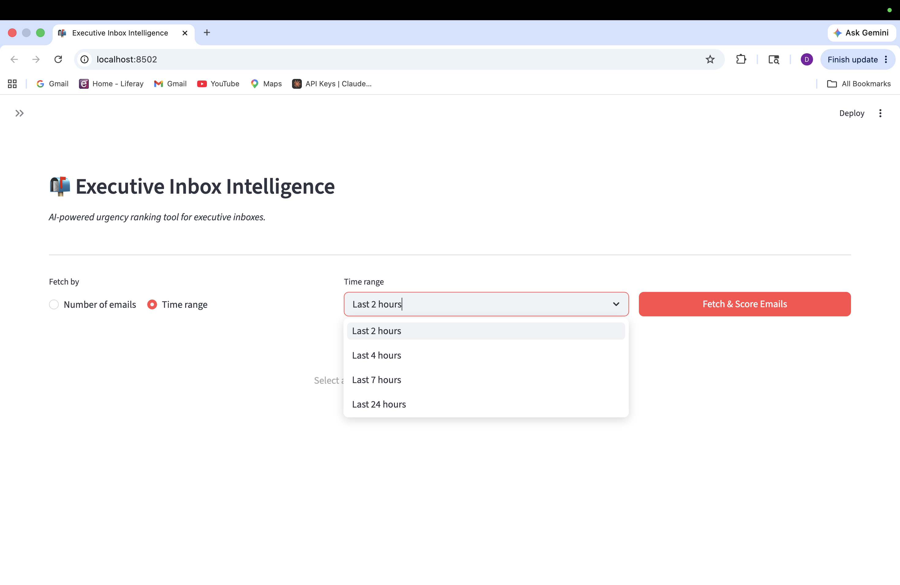
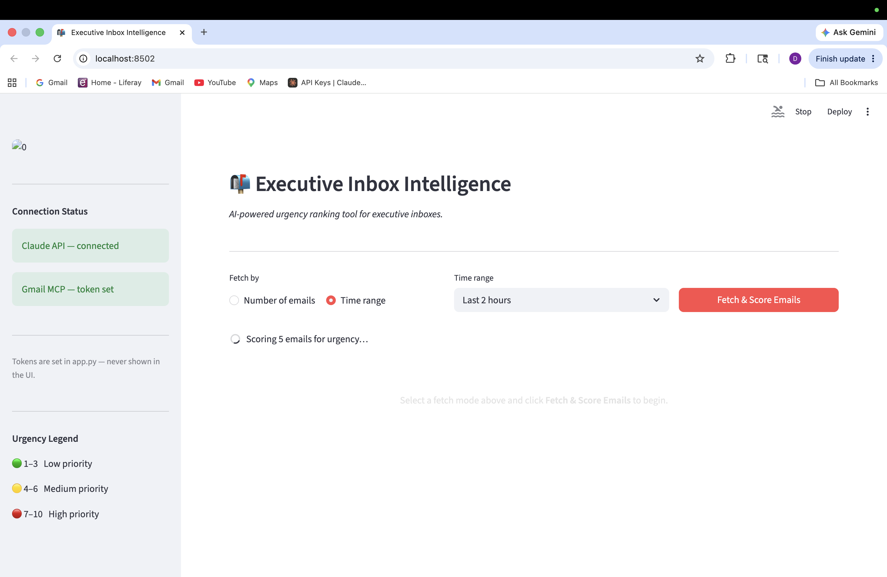
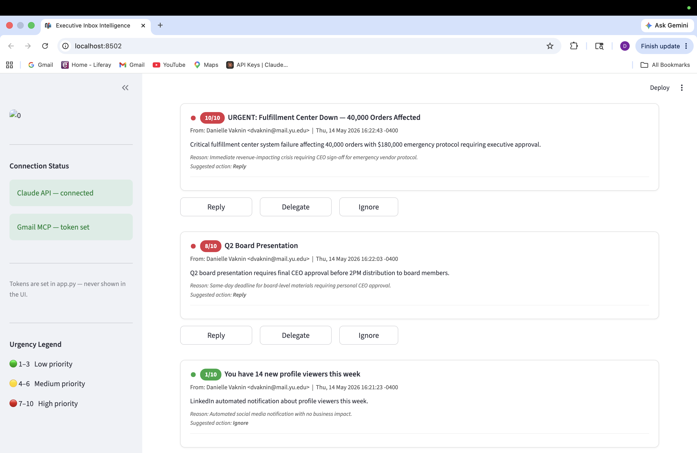
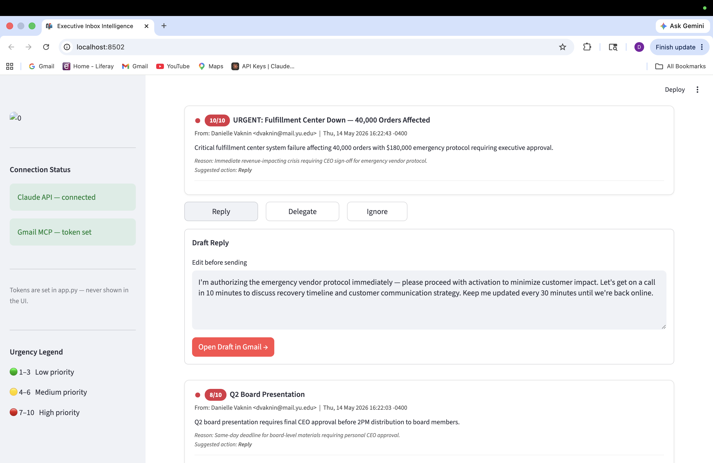
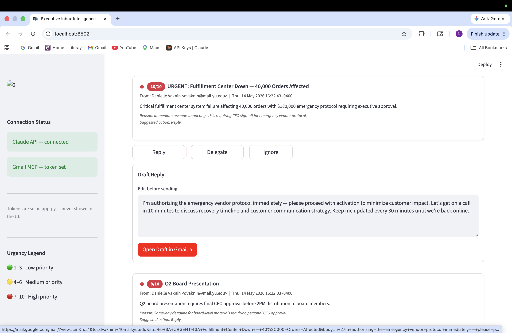
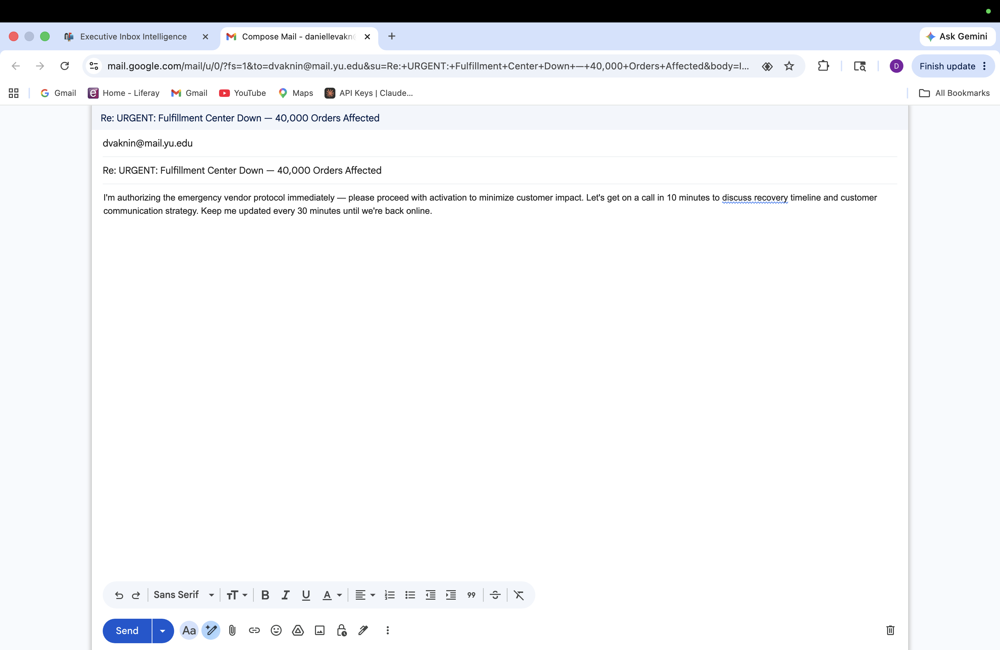
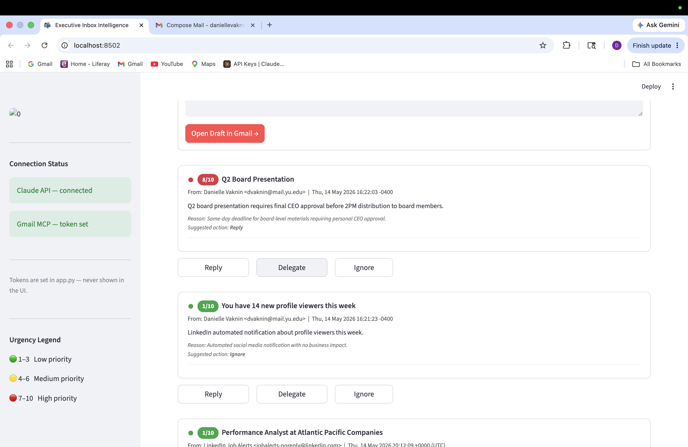
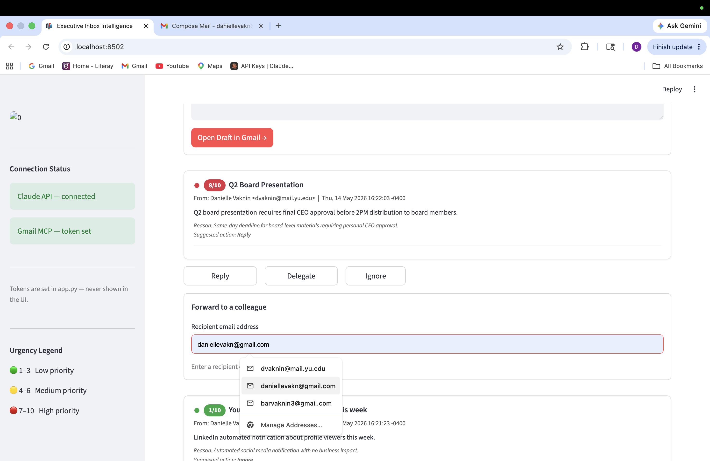

# Email Urgency Ranker

## The Problem
The President of a global company receives hundreds of emails 
daily. Manually triaging urgency wastes 30-45 minutes every 
morning and relies entirely on subjective judgment. 
Critical emails get missed. Non-urgent ones get prioritized.

## Why I Built It This Way
Streamlit was chosen over a plain HTML file because this tool 
requires a real backend to connect to Gmail via MCP — 
a browser-only file cannot authenticate with external services.

The scoring happens in a single Claude API call across all 
emails rather than one call per email, which keeps latency 
low and cost minimal.

Actions (reply/delegate/ignore) use mailto: links with 
pre-filled content rather than direct Gmail API calls — 
this eliminates OAuth complexity while still saving the 
user 90% of the effort of composing a reply from scratch.

## Business Impact
- Estimated 30-40 minutes saved per day in inbox triage
- Reduces missed critical emails by surfacing them at the top
- Suggested replies eliminate blank-page friction for responses

## Future Enhancements
- Refresh token handling so the session never expires mid-demo
- Composio integration to eliminate manual OAuth token setup
- Direct send via Gmail API instead of mailto: links
- Urgency trend over time — flag senders who are always urgent
- Slack alert for any email scored 9 or 10

These were descoped because the core value - a ranked, 
color-coded inbox — is fully demonstrable without them.

## Stack
- Python + Streamlit
- Anthropic Python SDK
- Gmail MCP via authorization token
- Claude claude-sonnet-4-20250514

## How to Run
1. Clone this repo
2. pip install streamlit anthropic
3. Add your API key and Gmail OAuth token at the top of app.py
4. streamlit run app.py
