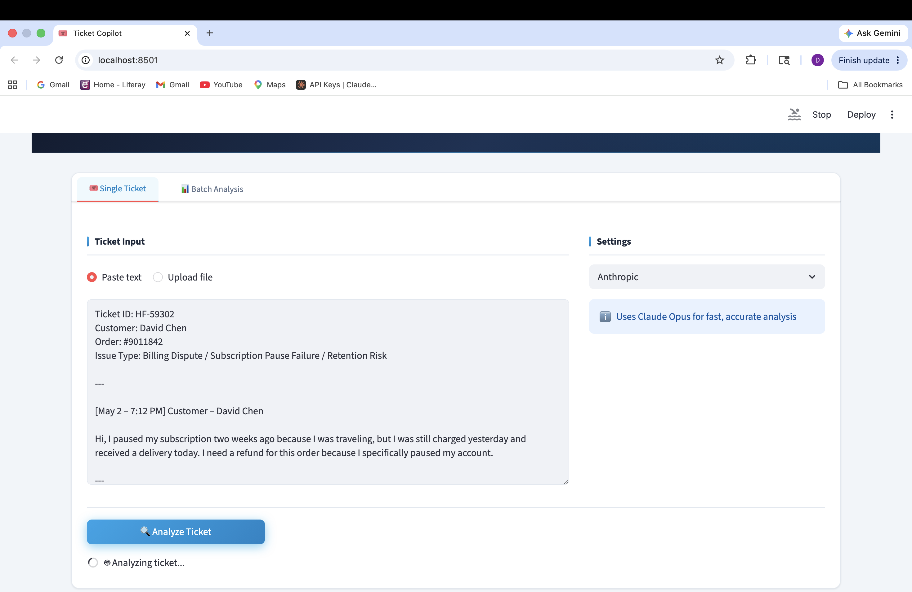
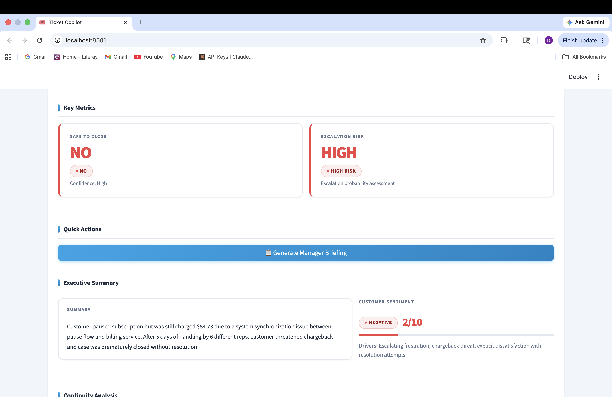
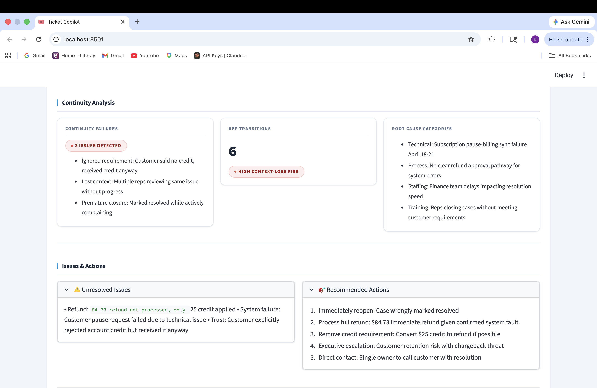
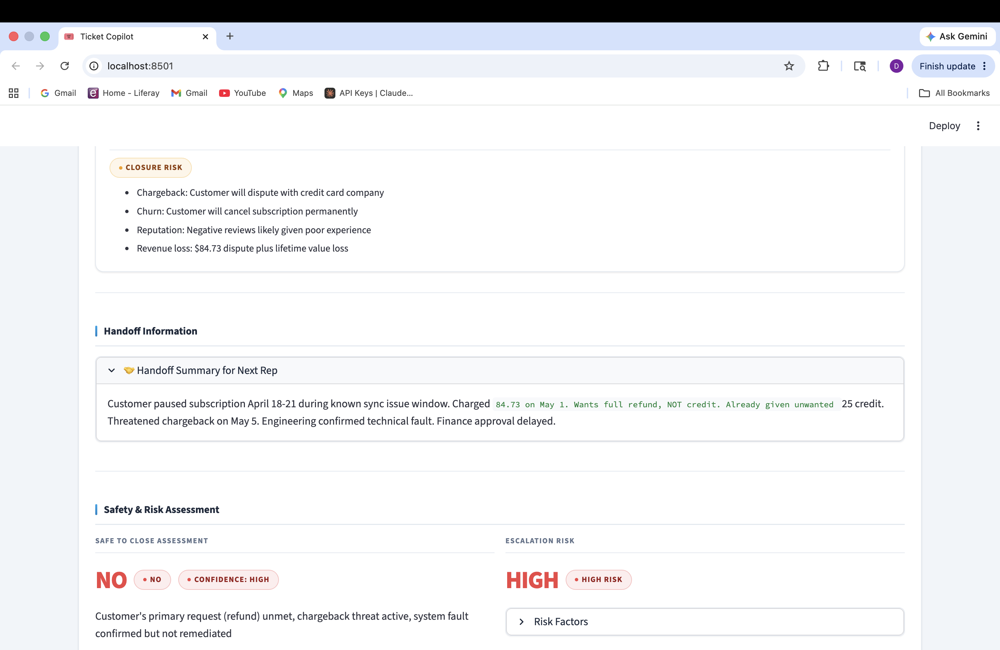

# Ticket Continuity Copilot

## The Problem
Customer support tickets get closed before issues are fully 
resolved. When multiple reps handle the same ticket, context 
gets lost in handoffs and customers have to repeat themselves. 
There is no consistent way to assess whether a ticket is 
actually safe to close.

## Why I Built It This Way
Streamlit was chosen for its built-in UI components — 
cards, color-coded sections, and expanders make structured 
output readable at a glance without any custom CSS.

A single Claude API call analyzes the full ticket thread 
and produces all seven output sections simultaneously, 
keeping latency under 5 seconds even for long threads.

The "safe to close" confidence score was the most important 
design decision — it gives the rep a clear yes/no signal 
backed by reasoning, rather than leaving judgment entirely 
to human interpretation.

## Business Impact
- Reduces premature ticket closure and repeat contacts
- Cuts handoff time from 10-15 minutes to under 1 minute
- Escalation risk flag surfaces tickets that need a manager 
  before they become complaints

## Output Sections
1. Executive summary
2. Unresolved issues list
3. Customer sentiment assessment
4. Handoff summary for next rep
5. Recommended next actions
6. Safe to close confidence score
7. Escalation risk level

## If I Had More Time
- Zendesk / Intercom / any other CRM direct integration to pull tickets 
  automatically rather than paste
- Bulk processing — analyze entire queue at once
- Pattern detection across tickets — flag recurring issues
- Auto-populate handoff notes back into the ticket system
- Automate bulk processing to occuur at the end of each day and produce daily reports sent directly to customer service manager

These were descoped to keep the tool runnable in a browser 
with zero integration setup.

## Stack
- Python + Streamlit
- Anthropic Python SDK
- claude-sonnet-4-20250514

## How to Run
1. Clone this repo
2. pip install streamlit anthropic
3. Add your Anthropic API key to the API_KEY variable
4. streamlit run app.py
